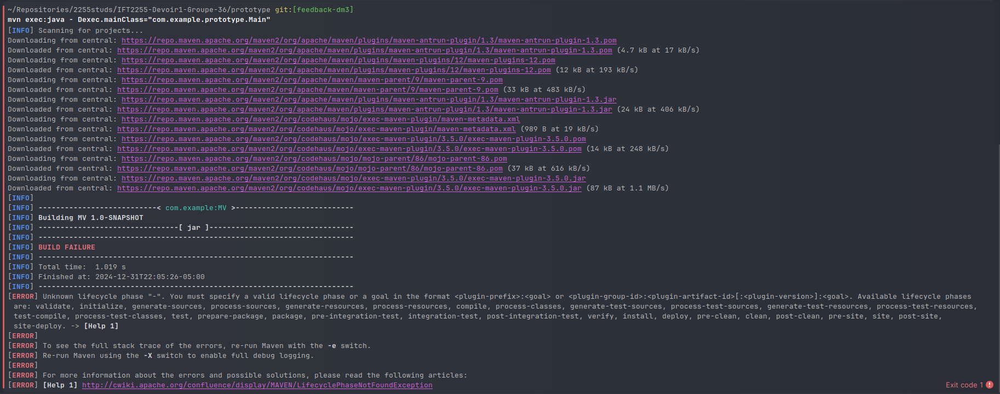
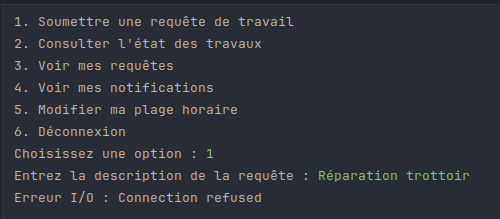

# Feedback DM3

## Application

Je tiens à dire d'abord que j'ai essayé d'installer votre application de trois manières: en générant le .jar, mais en essayant de le lancer ça me dit qu'il manque un MANIFEST au jar,
en exécutant `mvn exec:java -Dexec.mainClass="com.example.prototype.Main"`, ce qui ne marche juste pas, , et en lançant juste le `Main.java`. La dernière
option est la seule qui réussit à faire marcher l'application, mais elle a beaucoup de problèmes comme décrits ci-dessous.

### Fonctionnalités

Résidents:
- La création d'un compte résident ne vérifie pas que la date de naissance entrée est valide (ça accepte "blabla" ou 2), et je peux créer plusieurs comptes avec le même courriel.
- Zéro vérification du format pour les plages horaires entrées
- Concernant la requête de travail: .
- Consulter les travaux en cours, à venir, et les entraves ne marche pas. En particulier, une erreur `Connection refused` pour les entraves. 
- Aucun moyen de filtrer les travaux en cours, ni par quartier ni par rue.

Intervenants:
- Pareillement, je peux créer plusieurs comptes avec le même courriel.
- Quand on soumet une candidature, il semble n'y avoir aucun moyen d'ajouter un message ou une description.
- Quand on consulte les candidatures qu'on a soumis, on ne peut rien voir concernant leur statut.
- Aucun conflit n'est affiché quand l'horaire prévu est en conflit avec les préférences d'un/de plusieurs résident(s).

Globalement:
- Les données sont non persistentes. Quand je quitte l'appli et que je reviens dessus, les résidents que j'ai créé n'existent plus.
- On a demandé que l'application soit initialisée avec des résidents et des intervenants préexistants. Non seulement ils ne sont pas mentionnés dans le rapport, mais en plus ceux que je vois initialisés dans le code
du fichier `M̀ain` ne marchent pas.
- Si je crée un compte avec un courriel identique pour un résident et un intervenant, peu importe si je choisis de me connecter en tant que résident ou intervenant dans le menu principal 
ça va me rediriger vers le menu du résident.

## Code

- La fonction `main()` fait trop de choses. Elle devrait juste initialiser l'application.
- Beaucoup de conditions imbriquées difficiles à lire rien que dans le fichier `Main`.
- Très peu de commentaires pour expliquer le code interne à part dans la documentation JavaDoc.
- Jusqu'à maintenant il n'y a toujours aucune gestion de l'erreur `InputMismatchException` quand on écrit une lettre au lieu d'un chiffre.
- Les fichiers ne sont pas subdivisés en packages donc ils sont plus difficiles à séparer.

## Tests unitaires 

Pourquoi `mvn test` ne lance que les 3 premiers fichiers?

- `EntraveTest` : 1/1 tests passés
- `FiltreTravauxTest` : 1/1 tests passés
- `GestionnaireDonneesTest` : 1/1 tests passés
- `RequeteDeTravailTest` : 2/6 tests passés
- `UtilisateurTest` : 1/2 tests passés
- Le rapport des tests avec JaCoCo n'a pas été fait, et je ne peux pas non plus le faire moi-même avec JaCoCo car il manque la dépendance nécessaire dans votre
pom.xml pour lancer correctement `mvn jacoco:report`. D'ailleurs l'énoncé du devoir dit clairement de le faire vous-mêmes et de le rendre dans la remise.....

## Configuration Maven 

- La configuration est valide, peut exécuter les tests unitaires, et génère correctement le .jar. Sauf que le jar n'est pas exécutable.

## Démonstration

- Le son coupe pendant le moment où vous présentez l'ajout de plages horaires